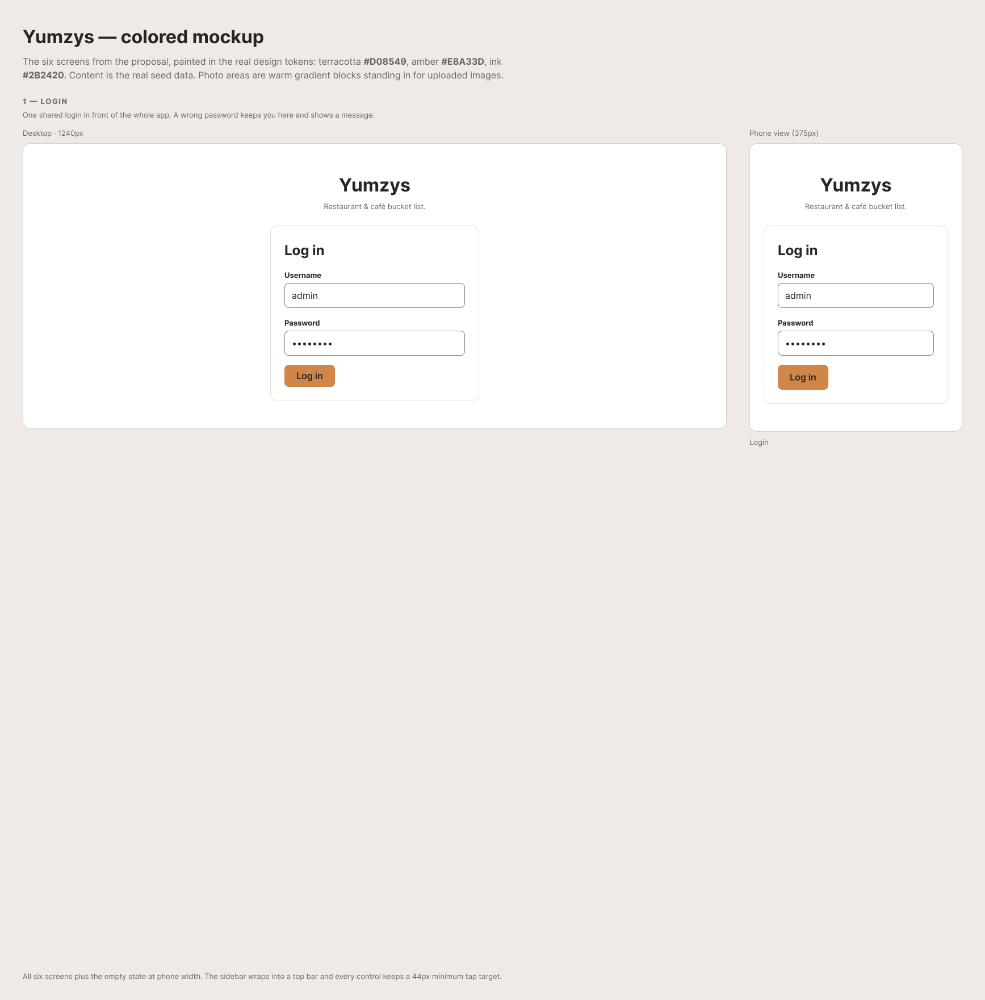
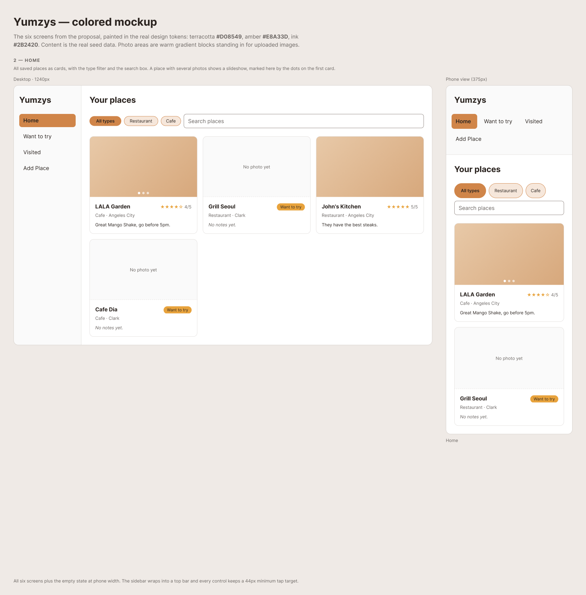
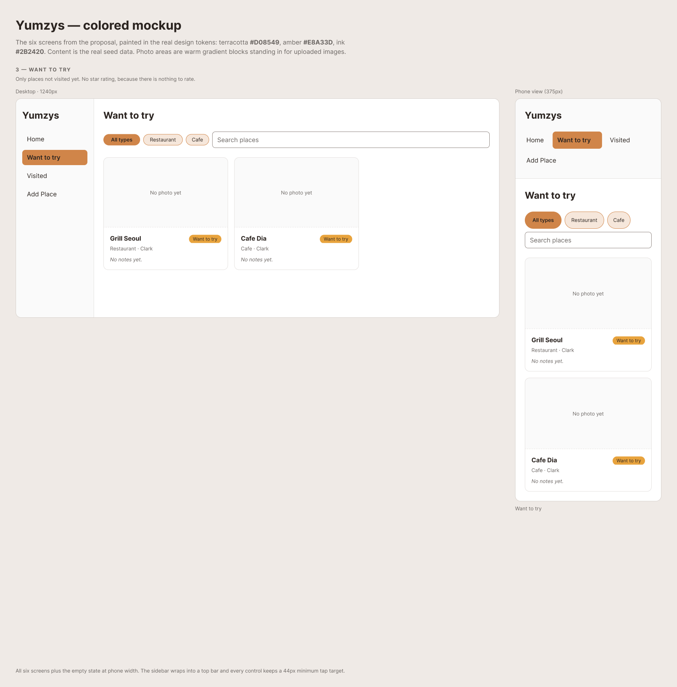
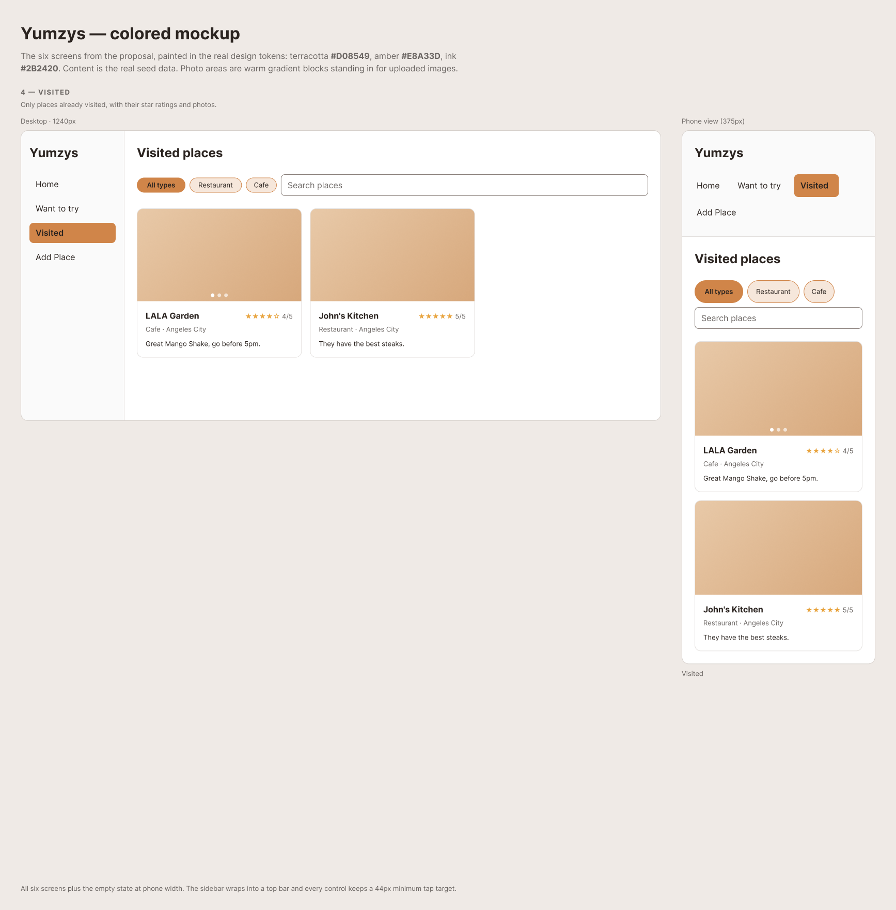
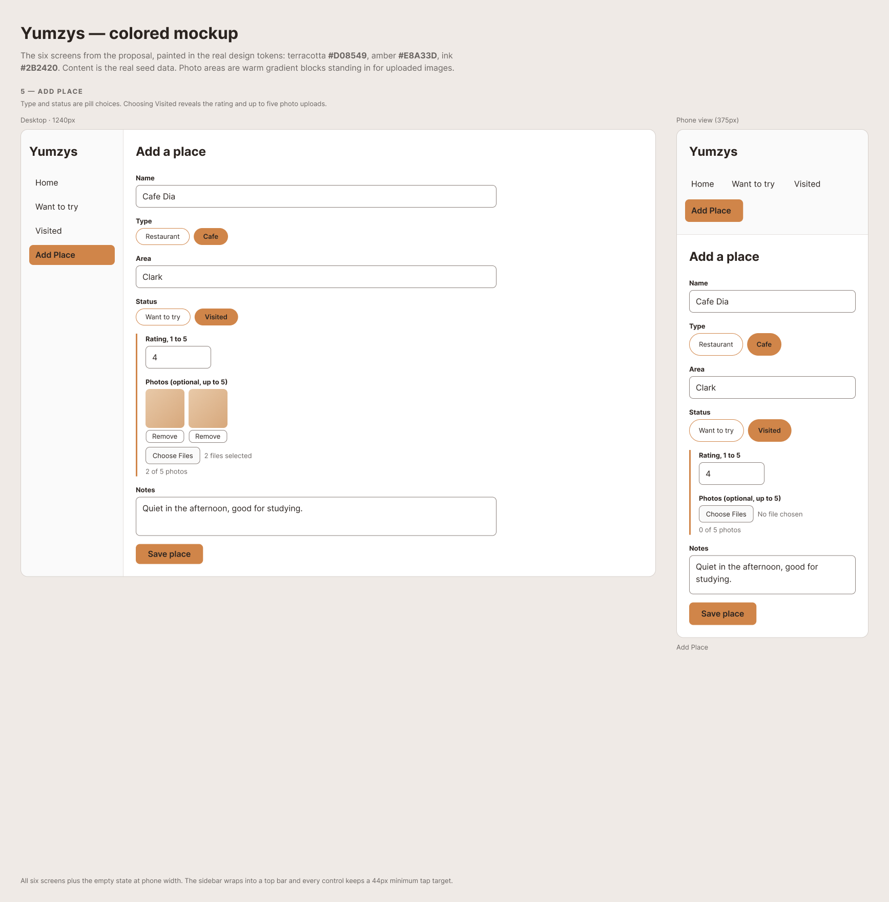
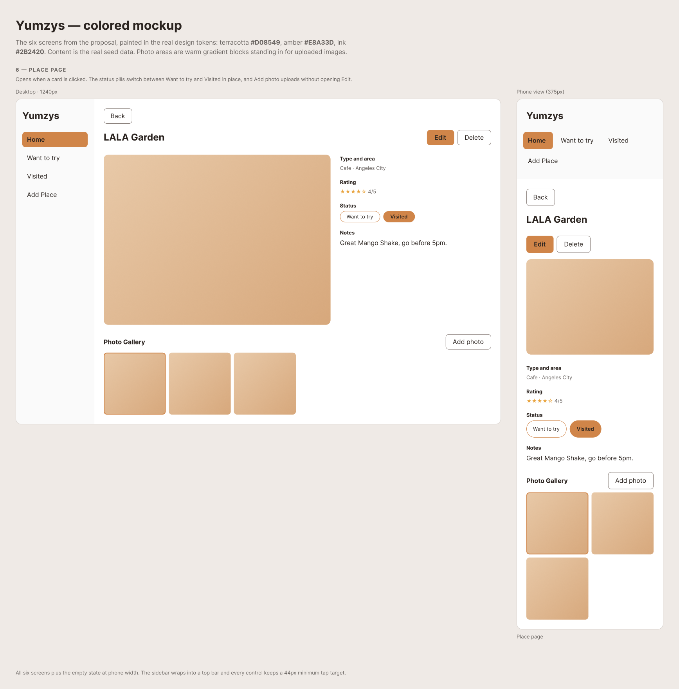
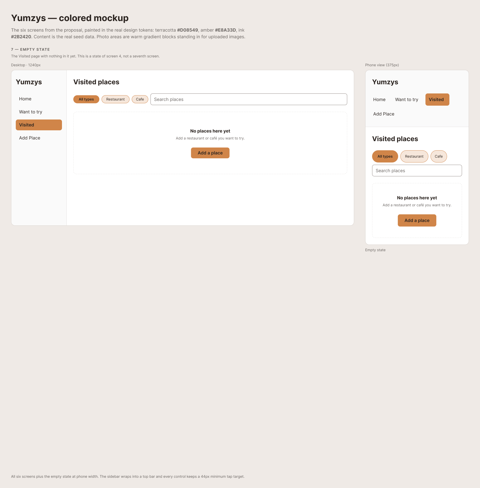

# Mockup

The mockup for Yumzys, built in Figma from a coloured HTML wireframe and exported
as the images below. It covers all six screens in my revised proposal, plus the
empty state.

Each image shows two widths side by side: the desktop layout at 1240px on the
left, and the phone layout at 375px on the right.

The content is the real seed data from `server/db/seed.sql`: LALA Garden, Grill
Seoul, John's Kitchen and Cafe Dia. Nothing here is placeholder text.

## Screens

### 1. Login

One shared login in front of the whole app. A wrong password keeps you on this
screen and shows a message.

### 2. Home

All saved places as cards, with the type filter buttons and the search box. A
place with more than one photo shows a slideshow, marked by the dots on the
first card.

### 3. Want to try

Only places I have not visited yet. These show a "Want to try" badge instead of
a star rating, because there is nothing to rate.

### 4. Visited

Only places I have visited, with their star ratings and photos.

### 5. Add Place

Type and status are pill choices rather than dropdowns. Choosing Visited reveals
the rating and up to five photo uploads.

### 6. Place page

Opens when I click a card. The status pills switch between Want to try and
Visited without leaving the page, and Add photo uploads without opening Edit.

## Empty state

The Visited page before anything has been marked visited. This is a state of
screen 4, not a seventh screen.

## On a phone

Shown in the right-hand column of every image above rather than as a separate
set. At 375px the sidebar wraps into a top bar, the card grid collapses to one
column, and every control keeps a 44 pixel minimum tap target.

## Honest note

Two differences between this mockup and the built app, both deliberate:

- The photo areas here are flat colour blocks standing in for real images. In
  the app these are my own photos, uploaded through Cloudinary.
- The slideshow is drawn as a static row of dots. In the app the dots look the
  same, but the photos cycle when you click them.

Everything else in the mockup is in the built app.
